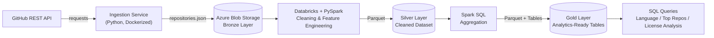

# DevPulse

An end-to-end ETL data pipeline that ingests live GitHub repository data, processes it through a Bronze → Silver → Gold medallion architecture on Databricks, and surfaces analytics on development trends.


---

## 📋 Overview

DevPulse pulls the top starred repositories across 14 major programming languages from the GitHub REST API, extracts and shapes the repository data, stages it in Azure Blob Storage, and transforms it with PySpark on Databricks into clean, query-ready analytics tables. 

The goal was to build a realistic, production-style data pipeline including: containerized ingestion, cloud object storage, a proper medallion (Bronze/Silver/Gold) architecture, and SQL-driven analysis using the same patterns used in real data engineering teams. The ingestion pipeline is automated, while the Databricks transformation is currently executed manually.

To illustrate the functionlity of the the pipeline, I answer the following three questions:

- Which programming languages dominate the most popular repositories on GitHub?
- Which repositories are the most influential on Github? (ranked by a combined popularity score?)
- Which open-source licenses are most common among popular projects, and how does license choice relate to star count?

## 🏗️ Architecture



🥉**Bronze** - JSON containing extracted GitHub repository records after schema mapping and deduplication, stored in Azure Blob Storage.  
🥈**Silver** - cleaned and typed data with license normalization, timestamp casting, and engineered features, stored as Parquet.  
🥇**Gold** - pre aggregated, business-question ready tables saved as Parquet and registered as Databricks tables for direct SQL querying.

## ✨ Features

- **Automated ingestion** from the GitHub Search API across 14 languages (Python, Java, JavaScript, TypeScript, Go, Rust, Ruby, C++, C, C#, PHP, Kotlin, Swift, Dart), filtered to repos with 1,000+ stars
- **Deduplication logic** to guarantee unique repositories across overlapping language queries
- **Containerized ingestion service** - runs anywhere via a single `docker run` command, configured entirely through environment variables
- **Cloud staging layer** using Azure Blob Storage as the Bronze landing zone
- **PySpark transformation pipeline** that:
  - Normalizes missing license values to `"No License"`
  - Casts string timestamps to proper timestamp types
  - Engineers `repo_age_years` and `popularity_score` (stars + forks) features
  - Converts JSON → Parquet for efficient analytical querying
- **Gold-layer SQL analytics** answering language popularity, top-repository ranking, and license-distribution questions
- **Reusable SQL query library** for querying the Gold tables directly from a SQL editor

## 🛠️ Tech Stack

| Layer | Technology |
|---|---|
| Language | Python |
| Ingestion | `requests`, GitHub REST API |
| Containerization | Docker |
| Cloud Storage | Azure Blob Storage (`azure-storage-blob`) |
| Transformation | PySpark (Databricks Notebooks) |
| Storage Format | JSON (raw) → Parquet (processed) |
| Analytics | Spark SQL, Databricks Tables |
| Config Management | `python-dotenv` |

## 📁 Project Structure

```text
DevPulse/
├── ingestion/
│   ├── main.py              # Pipeline entry point - orchestrates the full ingestion run
│   ├── config.py             # Loads env vars/secrets, defines target languages & GitHub API base URL
│   ├── github_client.py      # Handles GitHub API authentication and requests
│   ├── extractor.py          # Maps raw GitHub API responses into clean repository records
│   ├── uploader.py           # Uploads processed JSON to Azure Blob Storage
│   └── output/                # Local output of the ingestion run (JSON snapshots)
├── databricks/
│   └── transformation_pipeline.ipynb   # PySpark notebook: Bronze → Silver → Gold transformation & analysis
├── sql/
│   ├── top_repositories.sql          # Query: most influential repos by popularity score
│   ├── language_popularity.sql       # Query: average popularity by language
│   └── license_analysis.sql          # Query: license distribution and average stars
├── docs/
│   ├── cloud_storage.png       # Azure Blob Storage container showing Bronze, Silver, and Gold layers
│   ├── cloud_bronze.png        # Azure Blob Storage Bronze layer
│   ├── cloud_silver.png        # Azure Blob Storage Silver layer
│   └── cloud_gold.png          # Azure Blob Storage Gold layer
├── Dockerfile
├── requirements.txt
└── .gitignore
```

## ⚙️ How It Works

1. **Ingest** - `main.py` loops through 14 target languages, querying the GitHub Search API for repositories with 1,000+ stars (sorted by stars) via `github_client.py`.
2. **Extract & Shape** - `extractor.py` maps each raw API response into a clean, consistent schema (id, name, owner, language, stars, forks, watchers, open issues, license, timestamps, URL).
3. **Deduplicate** - repositories that show up under multiple language searches are collapsed into a single unique record by GitHub repo ID.
4. **Load to Bronze** - the deduplicated dataset is written to `ingestion/output/repositories.json` and uploaded to the `github-data` container in Azure Blob Storage via `uploader.py`.
5. **Transform (Databricks)** - the Bronze JSON is loaded into a Spark DataFrame in Databricks, where:
   - Null `license` values are standardized to `"No License"`
   - `created_at` / `updated_at` are cast from strings to proper timestamps
   - `repo_age_years` and `popularity_score` (`stars + forks`) are engineered as new features
   - The cleaned dataset is written out as Parquet to the **Silver** layer
6. **Aggregate to Gold** - Spark SQL queries answer the three core analytical questions, and the results are persisted as Parquet files and registered as Databricks tables (`top_repositories`, `language_popularity`, `license_analysis`) in the **Gold** layer.
7. **Analyze** - the `sql/` folder contains standalone SQL queries that can be run directly against the Gold tables from any SQL editor connected to the Databricks warehouse.

## 🧠 Design Decisions & Scope

The ingestion layer is fully automated and containerized, while the Databricks transformation is currently executed manually. This was an intentional scope decision rather than a limitation of the architecture.

The project was built using a student/free-tier environment, where keeping compute usage and cloud costs under control was a priority. Fully automating the Databricks stage with scheduled jobs or workflow orchestration would introduce additional managed compute usage and cloud costs that were unnecessary for the project's current dataset size and objectives.

The architecture was therefore designed so that the transformation and analytics stages can be automated later without changing the underlying Bronze → Silver → Gold data flow.

## 🚀 Getting Started

### Prerequisites

- Docker
- A [GitHub personal access token](https://github.com/settings/tokens) (no special scopes required for public repo search)
- An Azure Storage account with a Blob container named `github-data`
- Databricks Free Edition or another Databricks environment (for running the transformation notebook)

### 1️⃣ Clone the repository

```bash
git clone https://github.com/elbarbaa/DevPulse.git
cd DevPulse
```

### 2️⃣ Configure environment variables

Create a `.env` file in the project root:

```env
GITHUB_TOKEN=your_github_personal_access_token
AZURE_STORAGE_CONNECTION_STRING=your_azure_storage_connection_string
```

### 3️⃣ Build and run the ingestion service

```bash
docker build -t devpulse .
docker run --env-file .env devpulse
```

Alternatively, pass credentials directly at runtime:

```bash
docker run -e GITHUB_TOKEN=your_token -e AZURE_STORAGE_CONNECTION_STRING=your_connection_string devpulse
```

This collects the top-starred repositories for each configured language, deduplicates them, saves a local JSON snapshot to `ingestion/output/repositories.json`, and uploads it to Azure Blob Storage under `bronze/repositories.json`.

### 4️⃣ Run the transformation pipeline

1. Upload `bronze/repositories.json` to a location accessible from your Databricks workspace.
2. Import `databricks/transformation_pipeline.ipynb` into your Databricks workspace.
3. Run the notebook top to bottom to produce the Silver (cleaned) and Gold (aggregated) datasets, and to register the `top_repositories`, `language_popularity`, and `license_analysis` tables.

### 5️⃣ Query the results

Run any of the queries in `sql/` against the Gold tables from a Databricks SQL editor, for example:

```sql
SELECT
    name,
    owner,
    language,
    stars,
    forks,
    popularity_score,
    url
FROM top_repositories
ORDER BY popularity_score DESC
LIMIT 10;
```

## 🧪 Sample Record (Bronze Layer Snapshot)

```json
{
    "id": 54346799,
    "name": "public-apis",
    "full_name": "public-apis/public-apis",
    "owner": "public-apis",
    "language": "Python",
    "stars": 451385,
    "forks": 49663,
    "watchers": 451385,
    "open_issues": 1570,
    "license": "MIT License",
    "created_at": "2016-03-20T23:49:42Z",
    "updated_at": "2026-07-19T20:16:27Z",
    "url": "https://github.com/public-apis/public-apis"
}
```

## 🚀 Future Improvements

- [ ] **End-to-end orchestration** - automate the entire pipeline using Databricks Workflows, Azure Data Factory, or Airflow so ingestion and transformation run on a schedule without manual intervention
- [ ] **Incremental ingestion** - replace full dataset refreshes with incremental loads that only process newly discovered or updated repositories
- [ ] **Data quality checks** - add automated validation between Bronze, Silver, and Gold layers using tools such as Great Expectations or custom PySpark checks
- [ ] **Automated testing** - add unit tests for API extraction, response parsing, deduplication, and transformation logic
- [ ] **Pipeline parameterization** - allow languages, star thresholds, API pagination, and output locations to be configured without modifying source code
- [ ] **Monitoring & logging** - add structured logging and pipeline metrics for API failures, record counts, duplicate records, processing time, and data-quality issues
- [ ] **Production compute optimization** - use scheduled Databricks jobs with appropriately sized, ephemeral compute rather than manually running notebooks
- [ ] **Analytics dashboard** - connect the Gold tables to Power BI or Streamlit to provide interactive visualizations of repository popularity and language trends

## 🤝 Contributions

Contributions and improvements are welcome! please follow the following steps:
- Fork the repository
- Create a branch
- Make your changes
- Commit and push
- Submit a Pull Request

## 📄 License

This project is licensed under the [MIT License](LICENSE).
